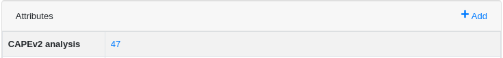
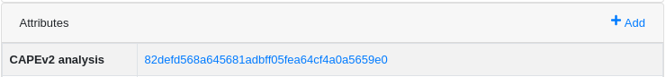

# mwdb-plugin-cape

A basic [CAPEv2](https://github.com/kevoreilly/CAPEv2/) plugin for [mwdb-core](https://github.com/CERT-Polska/mwdb-core) platform, loosely based on [mwdb-plugin-drakvuf](https://github.com/CERT-Polska/mwdb-plugin-drakvuf)


## Installation and configuration

### Fetch and install plugin
Within the same environment where `mwdb-core` is installed

```bash
$ git clone https://github.com/raw-data/mwdb-plugin-cape/
$ cd mwdb-plugin-cape
$ pip install .
```

Update mwdb configuration file, `mwdb.ini`, accordingly to your needs

```diff
- # plugins =
+ plugins = mwdb_plugin_cape

  ...

+ [cape]
+ cape_url = http://localhost:8443
+ # metakey_cape_url = http://localhost:8441
+ # metakey_value = file_sha1
+ # additional_analysis_options = {}
```

- `metakey_cape_url` can be set to a different value compared to _cape_url_, this comes in handy if you are dealing with port forwarding and the client is expecting to reach the sandbox on a different uri

- `metakey_value` _metakey_cape_url_ will head by default to the sample TaskID page, or to CAPE search page as an alternative, if the _file_sha1_ placeholder is set . The latter approach,  might be useful if CAPE is reset and as a consequence, Task ids do not match anymore MWDB samples.

_Note: choose carefully which approach fits you best, changing this in a second moment will break links to CAPE reports within MWDB_.

With default metakey_value (based on TaskID)



With metakey_value set to _file_sha1_



- `additional_analysis_options`, can be used to push additional analysis parameters to CAPEv2 API


### Apply changes, and run

```bash
$ mwdb-core configure

INFO  [mwdb.configure] Configuration already initialized... skipping
INFO  [mwdb.application] Loaded plugin 'mwdb_plugin_cape'
INFO  [alembic.runtime.migration] Context impl PostgresqlImpl.
INFO  [alembic.runtime.migration] Will assume transactional DDL.
INFO  [mwdb.configure] Database already initialized... skipping
INFO  [mwdb.plugin.cape] Configuring 'CAPEv2' attribute key.
INFO  [mwdb.application] Configured plugin 'mwdb_plugin_cape'

MWDB configured successfully!

Use 'mwdb-core run' to run the server.

$ mwdb-core run
...
[INFO] MainThread - plugins.load_plugins:147 - Loaded plugin 'mwdb_plugin_cape'
...
```